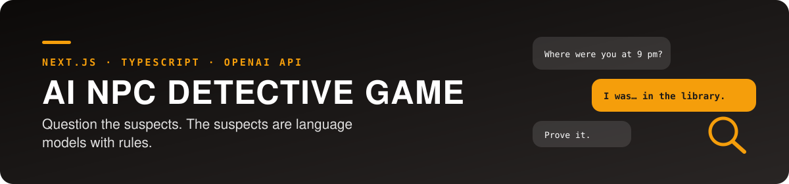
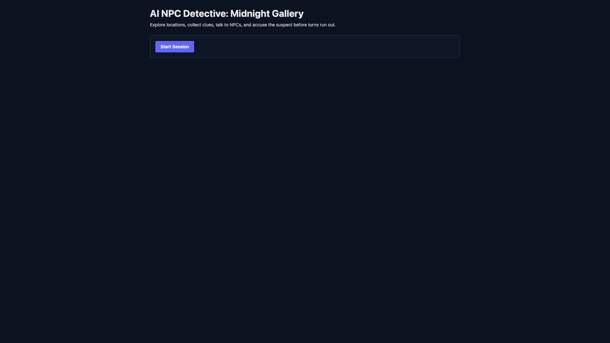
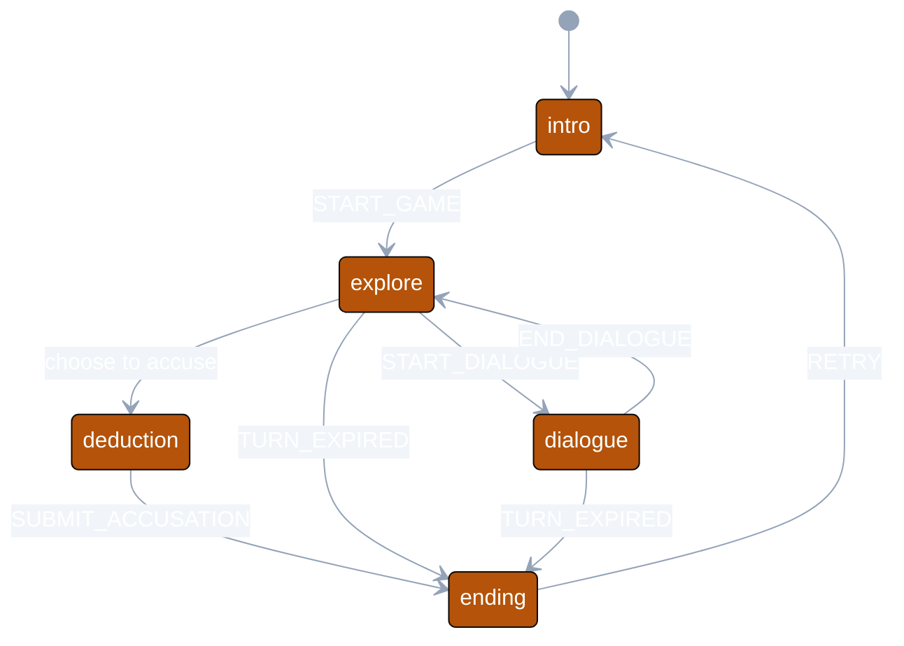
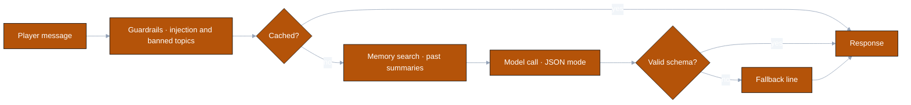

<div align="center">




Personal project · February 2026

[Why](#why) · [How it works](#how-it-works) · [My role](#my-role) · [Results](#results) · [Limitations](#limitations-and-next-steps)

</div>

---

> **Where it stands — playable MVP**  
> One 20–30 minute mystery episode runs from briefing to ending, with guardrails, memory and a metrics dashboard.  
> Sessions and metrics live in memory only, and there is a single episode.



| | |
|---|---|
| Period | February 2026 |
| Team | Individual |
| Stack | Next.js (App Router), TypeScript, Tailwind CSS, Zustand, OpenAI API, Prisma, PostgreSQL, Vercel |

## Why

Putting a language model behind a game character looks convincing in a demo and breaks in a real game. The character drifts from its backstory, players talk it into revealing the answer, the response format falls apart, and every call costs money. This project works through those problems while keeping one mystery episode playable from start to finish.

| Keep the game in control | Keep the NPC in character | Keep the cost visible |
| :--- | :--- | :--- |
| State machine decides what is allowed | Schema validation · injection filter · banned topics | Latency · tokens · cache hits · errors |
| `packages/game-engine` | `packages/prompt-kit` | `/admin` dashboard |

## How it works

The player explores locations, collects clues, questions NPCs, then names a suspect.



Rules enforced by the state machine: an accusation needs at least three clues, a conversation can only start where that NPC is, and every action uses a turn.

Each line of NPC dialogue passes through a pipeline before the player sees it.



## My role

Individual project: design, implementation and documentation.

- The game state machine and ending evaluation (`packages/game-engine`).
- The NPC dialogue pipeline: prompt construction, JSON response validation, guardrails (`packages/prompt-kit`, `apps/web/src/lib`).
- Conversation summary memory and the response cache.
- The metrics API and admin screen for latency, tokens, cache hit rate and errors.
- The PRD, technical design, performance report and troubleshooting notes (`docs/`).

## What I learned

- Designing around an untrusted model: validate every response against a schema and fall back to a prepared line when it fails.
- Filtering prompt injection at the input, and where that approach stops working.
- Cutting token cost with a cache for repeated questions and a cap on stored summaries.
- Keeping game rules in a state machine makes them testable without the UI.
- Splitting a monorepo into packages and keeping path aliases consistent.

## Resources used

- Next.js, OpenAI API, Prisma and Zustand documentation
- Vercel deployment documentation

## Results

| Core loop | Checks | Observability |
| :---: | :---: | :---: |
| **Briefing → ending** | **lint · test · build pass** | **4 metrics tracked** |

- The full loop works: explore, talk, deduce, ending.
- `npm run lint`, `npm run test` and `npm run build` pass.
- The admin screen shows API latency, token usage, cache hit rate and recent errors.


## Limitations and next steps

| Limitation | Next step |
| :--- | :--- |
| Sessions and metrics are in memory and vanish on restart | Connect the Prisma schema that already exists |
| Memory search is word overlap, not meaning | Embedding search with pgvector |
| Only average latency is tracked | p50/p95 and cost per session |
| No load testing | Simulate concurrent sessions |
| One episode | More cases on the same engine |

## Repository layout

| Path | Contents |
| :--- | :--- |
| `apps/web` | Frontend, API routes, admin dashboard |
| `packages/game-engine` | State machine and ending evaluation |
| `packages/prompt-kit` | Prompts and response validation |
| `packages/data` | Prisma schema and data-layer types |
| `docs` | PRD, technical design, performance report, troubleshooting |

## Quick start

```bash
npm install
cp .env.example .env.local
npm run dev
```

- Game: `http://localhost:3000`
- Metrics: `http://localhost:3000/admin`

<details>
<summary><strong>Scripts, environment variables, deployment</strong></summary>

| Script | Purpose |
| :--- | :--- |
| `npm run dev` | Development server |
| `npm run lint` | Lint the web app |
| `npm run test` | Game engine tests |
| `npm run build` | Production build |

| Variable | Purpose |
| :--- | :--- |
| `OPENAI_API_KEY` | Key for NPC dialogue calls |
| `DATABASE_URL` | Prisma/PostgreSQL connection string |
| `NEXT_PUBLIC_APP_NAME` | App name (optional) |

Deployment: create a Vercel project at the repository root, register the environment variables, deploy `main`, then run the smoke test in `docs/staging-checklist.md`.

</details>
